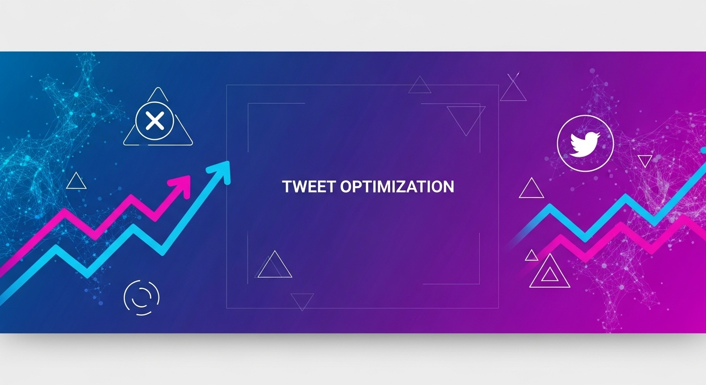
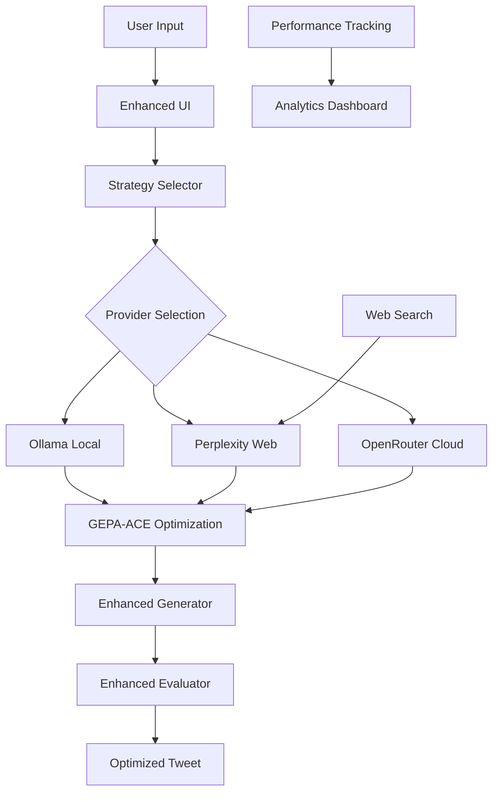

# Enhanced DSPy Tweet Optimizer 🚀



<div align="center">


**Advanced AI-Powered Tweet Optimization with Multi-LLM Integration**

[Features](#-enhanced-features) • [Installation](#-installation) • [Usage](#-usage) • [Architecture](#-architecture) • [Advanced Features](#-advanced-features)

</div>

---

## ✨ Enhanced Features

### 🤖 Multi-LLM Integration
- **Local Processing**: Ollama integration for private, fast inference
- **Web Search**: Perplexity API for real-time information and context
- **Cloud Models**: OpenRouter integration for advanced reasoning
- **Hybrid Mode**: Automatic provider selection based on task requirements

### 🧠 Advanced AI Frameworks
- **GEPA-ACE**: Context optimization and compression
- **Ax LLM**: Advanced model orchestration and routing
- **Web Search**: Real-time information gathering for tweet optimization
- **Performance Tracking**: Comprehensive metrics and analytics

### 🎯 Optimization Strategies
- **Local Fast**: Use Ollama for quick, private processing
- **Web Enhanced**: Leverage Perplexity for current trends and context
- **Hybrid Balanced**: Automatic selection of best provider
- **Creative Mode**: Use Claude for creative and engaging content

### 📊 Enhanced Analytics
- **Real-time Provider Status**: Monitor all LLM providers
- **Performance Metrics**: Track response times and success rates
- **Web Context Display**: See real-time information used for optimization
- **Advanced Categories**: Enhanced evaluation criteria with trend awareness

## 🔧 Installation

### Quick Setup

1. **Run the automated setup script:**
```bash
python setup_advanced_system.py
```

2. **Or manual installation:**

```bash
# Clone the repository
git clone https://github.com/arnaudbellemare/dspy-tweet-optimizer.git
cd dspy-tweet-optimizer

# Install dependencies
pip install -r requirements.txt

# Install Ollama (for local LLMs)
# macOS:
brew install ollama
# Linux:
curl -fsSL https://ollama.ai/install.sh | sh
# Windows: Download from https://ollama.ai/download

# Start Ollama service
ollama serve

# Install recommended models
ollama pull llama3.2:latest
ollama pull mistral:latest
ollama pull codellama:latest
```

### API Keys Setup

#### Perplexity API (for web search)
1. Go to [Perplexity API Settings](https://www.perplexity.ai/settings/api)
2. Create an account and generate an API key
3. Set environment variable:
```bash
export PERPLEXITY_API_KEY='your-api-key-here'
```

#### OpenRouter API (for cloud models)
1. Go to [OpenRouter](https://openrouter.ai/)
2. Create an account and generate an API key
3. Set environment variable:
```bash
export OPENROUTER_API_KEY='your-api-key-here'
```

## 🚀 Usage

### Basic Usage

```bash
# Run the enhanced application
streamlit run enhanced_app.py
```

### Advanced Usage

```python
from enhanced_dspy_modules import get_enhanced_modules
from advanced_llm_manager import setup_advanced_llm_system

# Initialize the enhanced system
setup_advanced_llm_system()
enhanced_modules = get_enhanced_modules()

# Use enhanced modules
generator = enhanced_modules["generator"]
evaluator = enhanced_modules["evaluator"]

# Generate optimized tweet
tweet = generator.forward("Your input text here")
```

## 🏗️ Architecture

### Enhanced System Components

```
Enhanced DSPy Tweet Optimizer/
├── enhanced_app.py                 # Main enhanced application
├── advanced_llm_manager.py         # Multi-LLM provider management
├── enhanced_dspy_modules.py        # Enhanced DSPy modules
├── enhanced_ui_components.py       # Advanced UI components
├── enhanced_constants.py           # Enhanced configuration
├── setup_advanced_system.py        # Automated setup script
├── ENHANCED_README.md              # This file
└── [Original files...]             # Original system files
```

### Multi-LLM Architecture



## 🔥 Advanced Features

### 1. Multi-LLM Provider System

The enhanced system supports multiple LLM providers with automatic routing:

```python
# Local Ollama models
ollama_provider = OllamaProvider(config)
advanced_llm_manager.add_provider("ollama_llama3.2", ollama_provider)

# Perplexity with web search
perplexity_provider = PerplexityProvider(config)
advanced_llm_manager.add_provider("perplexity_sonar", perplexity_provider)

# Hybrid mode for automatic selection
advanced_llm_manager.set_hybrid_mode(True)
```

### 2. GEPA-ACE Context Optimization

Advanced context optimization for better performance:

```python
gepa_ace = GEPAACEOptimizer()
optimized_context = gepa_ace.optimize_context(
    prompt="Your prompt",
    context="Long context text...",
    target_length=1000
)
```

### 3. Web Search Integration

Real-time web information for tweet optimization:

```python
web_search = WebSearchModule()
context = web_search.search_relevant_context("AI trends 2024")
```

### 4. Performance Analytics

Comprehensive performance tracking:

```python
# Get system status
status = advanced_llm_manager.get_status()

# Performance metrics
metrics = status["ax_manager_stats"]["performance_metrics"]
```

## 🎯 Optimization Strategies

### Local Fast Strategy
- **Use Case**: Quick, private processing
- **Providers**: Ollama models
- **Features**: Fast inference, no internet required
- **Best For**: Personal use, sensitive content

### Web Enhanced Strategy
- **Use Case**: Current trends and real-time information
- **Providers**: Perplexity API
- **Features**: Web search, current events, trending topics
- **Best For**: Marketing, news, trending topics

### Hybrid Balanced Strategy
- **Use Case**: Automatic optimization
- **Providers**: All available providers
- **Features**: Smart routing, best performance
- **Best For**: Production use, maximum quality

### Creative Mode Strategy
- **Use Case**: Creative and engaging content
- **Providers**: Claude via OpenRouter
- **Features**: Advanced reasoning, creative writing
- **Best For**: Brand content, storytelling

## 📊 Performance Monitoring

### Real-time Metrics
- **Provider Status**: Live status of all LLM providers
- **Response Times**: Average response time per provider
- **Success Rates**: Success/failure rates for each provider
- **Token Usage**: Track token consumption and costs

### Analytics Dashboard
- **Optimization History**: Track optimization performance over time
- **Provider Performance**: Compare different providers
- **Cost Analysis**: Monitor API usage and costs
- **Quality Metrics**: Track tweet quality improvements

## 🔧 Configuration

### Environment Variables

```bash
# Required for Perplexity
PERPLEXITY_API_KEY=your-perplexity-key

# Required for OpenRouter
OPENROUTER_API_KEY=your-openrouter-key

# Optional Ollama configuration
OLLAMA_BASE_URL=http://localhost:11434
```

### Advanced Configuration

Edit `enhanced_constants.py` to customize:

```python
# Optimization strategies
OPTIMIZATION_STRATEGIES = {
    "custom_strategy": {
        "name": "Custom Strategy",
        "description": "Your custom optimization approach",
        "providers": ["ollama", "perplexity"],
        "use_web_search": True,
        "use_context_optimization": True
    }
}

# GEPA-ACE settings
GEPA_ACE_CONFIG = {
    "max_context_length": 2000,
    "compression_ratio": 0.7,
    "cache_size": 100
}
```

## 🧪 Testing

### Run Enhanced Tests

```bash
# Test the enhanced system
python -c "from enhanced_dspy_modules import initialize_enhanced_system; initialize_enhanced_system()"

# Test specific providers
python -c "from advanced_llm_manager import setup_advanced_llm_system; setup_advanced_llm_system()"

# Run original tests
pytest tests/
```

### System Verification

```bash
# Check Ollama status
ollama list

# Test Perplexity API
curl -H "Authorization: Bearer $PERPLEXITY_API_KEY" https://api.perplexity.ai/models

# Test OpenRouter API
curl -H "Authorization: Bearer $OPENROUTER_API_KEY" https://openrouter.ai/api/v1/models
```

## 🚀 Deployment

### Local Deployment

```bash
# Run with custom port
streamlit run enhanced_app.py --server.port 8501

# Run with custom host
streamlit run enhanced_app.py --server.address 0.0.0.0
```

### Cloud Deployment

The enhanced system is compatible with:
- **Streamlit Cloud**: Deploy directly from GitHub
- **Docker**: Use the provided Dockerfile
- **AWS/GCP/Azure**: Deploy as containerized application

## 🔍 Troubleshooting

### Common Issues

#### Ollama Not Starting
```bash
# Check if Ollama is installed
ollama --version

# Start Ollama service
ollama serve

# Check if service is running
curl http://localhost:11434/api/tags
```

#### API Key Issues
```bash
# Check environment variables
echo $PERPLEXITY_API_KEY
echo $OPENROUTER_API_KEY

# Test API keys
python -c "import os; print('Perplexity:', bool(os.getenv('PERPLEXITY_API_KEY')))"
```

#### Model Loading Issues
```bash
# List available models
ollama list

# Pull missing models
ollama pull llama3.2:latest
ollama pull mistral:latest
```

### Performance Optimization

#### For Local Processing
- Use smaller models for faster inference
- Enable GPU acceleration if available
- Adjust context length based on needs

#### For Web Search
- Cache search results to reduce API calls
- Use specific search queries for better results
- Monitor API usage and costs

## 🤝 Contributing

Contributions are welcome! Please see our [Contributing Guidelines](CONTRIBUTING.md).

### Development Setup

```bash
# Clone repository
git clone https://github.com/arnaudbellemare/dspy-tweet-optimizer.git
cd dspy-tweet-optimizer

# Install development dependencies
pip install -r requirements-dev.txt

# Run tests
pytest tests/

# Run linting
flake8 enhanced_*.py
```

## 📄 License

MIT License - see [LICENSE](LICENSE) file for details.

## 🙏 Acknowledgments

- Built with [DSPy](https://github.com/stanfordnlp/dspy) by Stanford NLP
- Enhanced with [Ollama](https://ollama.ai/) for local LLM processing
- Powered by [Perplexity](https://www.perplexity.ai/) for web search
- Integrated with [OpenRouter](https://openrouter.ai/) for cloud models
- UI built with [Streamlit](https://streamlit.io/)

## 📞 Support

For issues, questions, or suggestions:
- [Open an issue](https://github.com/arnaudbellemare/dspy-tweet-optimizer/issues)
- [Join discussions](https://github.com/arnaudbellemare/dspy-tweet-optimizer/discussions)
- [Check documentation](https://github.com/arnaudbellemare/dspy-tweet-optimizer/wiki)

---

<div align="center">

**Enhanced DSPy Tweet Optimizer** - The future of AI-powered content optimization

[⬆ Back to Top](#enhanced-dspy-tweet-optimizer-)

</div>
