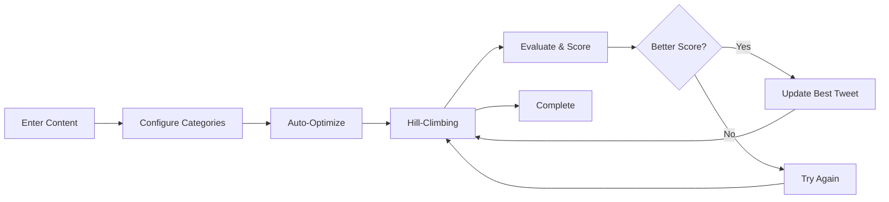

# DSPy Tweet Optimizer


<div align="center">


**AI-Powered Tweet Optimization Using Hill-Climbing Algorithm**

[Features](#features) • [Installation](#installation) • [Usage](#how-it-works) • [Architecture](#architecture) • [Testing](#testing)

</div>

---

## ✨ Features

- 🤖 **AI-Powered Optimization**: Uses Claude 3.5 Sonnet (via OpenRouter) to generate and refine tweets
- 📈 **Hill-Climbing Algorithm**: Automatically improves tweets through iterative evaluation
- 🎯 **Customizable Categories**: Define your own evaluation criteria (e.g., clarity, engagement, tone)
- ⚡ **Real-Time Progress**: Watch the optimization process with detailed feedback
- 📝 **Input History**: Quick access to previously optimized content
- 🔍 **Structured Evaluation**: 1-9 scoring scale with detailed reasoning for each category
- 🚀 **Auto-Optimization**: Starts working as soon as you enter text
- 🎨 **Clean UI**: Professional black/white theme with red accents

## 🔧 How It Works



1. **Enter your content** - Type or paste what you want to optimize
2. **Configure categories** - Set up evaluation criteria (or use defaults)
3. **Auto-optimize** - The system automatically generates and improves tweets
4. **Hill-climbing** - Each iteration tries to beat the previous best score
5. **Transparency** - See the AI's reasoning for each evaluation

## 📦 Installation

### Prerequisites

- Python 3.11+
- OpenRouter API key ([Get one here](https://openrouter.ai/))

### Setup

1. **Clone the repository:**
```bash
git clone https://github.com/tom-doerr/dspy-tweet-optimizer.git
cd dspy-tweet-optimizer
```

2. **Install dependencies:**
```bash
pip install -r requirements.txt
```

3. **Set up your API key:**
```bash
export OPENROUTER_API_KEY='your-api-key-here'
```

4. **Run the application:**
```bash
streamlit run app.py --server.port 5000
```

5. **Open your browser** to `http://localhost:5000`

## ⚙️ Configuration

### Categories

Define custom evaluation categories in the UI or edit `categories.json`:
```json
[
  "Clarity",
  "Engagement",
  "Professionalism"
]
```

### Settings

Adjust optimization parameters in the Settings section:
- **Model**: Choose from various OpenRouter models
- **Max Iterations**: How many optimization attempts (1-50)
- **Patience**: Stop after N iterations without improvement

## 🏗️ Architecture

### Core Components

| Component | Description |
|-----------|-------------|
| **TweetGeneratorModule** | DSPy module for generating/improving tweets |
| **TweetEvaluatorModule** | DSPy module for structured evaluation with reasoning |
| **Hill-Climbing Algorithm** | Iterative optimization with configurable patience |
| **SessionStateManager** | Centralized state management |
| **OptimizationManager** | Handles the optimization loop |

### Design Principles

- ✅ **DRY**: No code duplication through helper functions and manager classes
- ✅ **Type Safety**: Comprehensive type hints using Pydantic models
- ✅ **Modular**: Clean separation between UI, business logic, and utilities
- ✅ **Constants**: All magic numbers centralized in `constants.py`

### Module Structure

```
dspy-tweet-optimizer/
├── app.py                      # Main application entry point
├── constants.py                # Configuration and constants
├── session_state_manager.py   # State management
├── optimization_manager.py    # Optimization loop logic
├── helpers.py                  # Utility functions
├── ui_components.py            # UI rendering functions
├── models.py                   # Pydantic data models
├── dspy_modules.py             # DSPy module implementations
├── hill_climbing.py            # Optimization algorithm
├── utils.py                    # File I/O and utilities
└── tests/                      # Comprehensive test suite
    ├── conftest.py
    ├── test_models.py
    ├── test_helpers.py
    ├── test_session_state_manager.py
    ├── test_utils.py
    └── integration/
        ├── conftest.py
        ├── test_optimization_flow.py
        ├── test_file_operations.py
        └── test_dspy_modules.py
```

## 🧪 Testing

Run the comprehensive test suite:

```bash
# Run all tests (unit + integration)
pytest tests/

# Run with verbose output
pytest tests/ -v

# Run only unit tests
pytest tests/ --ignore=tests/integration/

# Run only integration tests
pytest tests/integration/

# Run specific test file
pytest tests/test_models.py
```

### Test Coverage

| Test Type | Count | Coverage |
|-----------|-------|----------|
| **Unit Tests** | 48 | Models, helpers, state management, utilities |
| **Integration Tests** | 24 | Optimization flow, file operations, DSPy modules |
| **Total Tests** | 72 | ~8 seconds execution time |

**Test Categories:**
- ✅ Pydantic Models: Score validation, comparisons, field requirements
- ✅ Helper Functions: Text formatting, truncation, settings management
- ✅ Session State Manager: Initialization, updates, state reset
- ✅ Optimization Flow: Hill-climbing with patience, max iterations
- ✅ File Operations: Real file I/O with temporary directories
- ✅ DSPy Modules: Generator/evaluator interaction and feedback loops

## 🛠️ Technology Stack

<div align="center">

| Technology | Purpose |
|------------|---------|
|  | Web application framework |
|  | Language model programming framework |
|  | Data validation and type safety |
|  | LLM API gateway |
|  | Testing framework |
|  | AI model |

</div>

## 💡 Use Cases

- 📱 Social media content optimization
- 🎯 Marketing copy refinement
- 📢 Announcement crafting
- 💬 Community engagement posts
- 🚀 Product launch tweets

## 🤝 Contributing

Contributions are welcome! Please feel free to submit a Pull Request.

1. Fork the repository
2. Create your feature branch (`git checkout -b feature/amazing-feature`)
3. Commit your changes (`git commit -m 'Add some amazing feature'`)
4. Push to the branch (`git push origin feature/amazing-feature`)
5. Open a Pull Request

## 📄 License

MIT License - see [LICENSE](LICENSE) file for details

## 🙏 Acknowledgments

- Built with [DSPy](https://github.com/stanfordnlp/dspy) by Stanford NLP
- Powered by [OpenRouter](https://openrouter.ai/)
- UI built with [Streamlit](https://streamlit.io/)

## 📞 Support

For issues, questions, or suggestions, please [open an issue](https://github.com/tom-doerr/dspy-tweet-optimizer/issues) on GitHub.

---

<div align="center">

Made with ❤️ using DSPy and Claude 3.5 Sonnet

[⬆ Back to Top](#dspy-tweet-optimizer)

</div>
